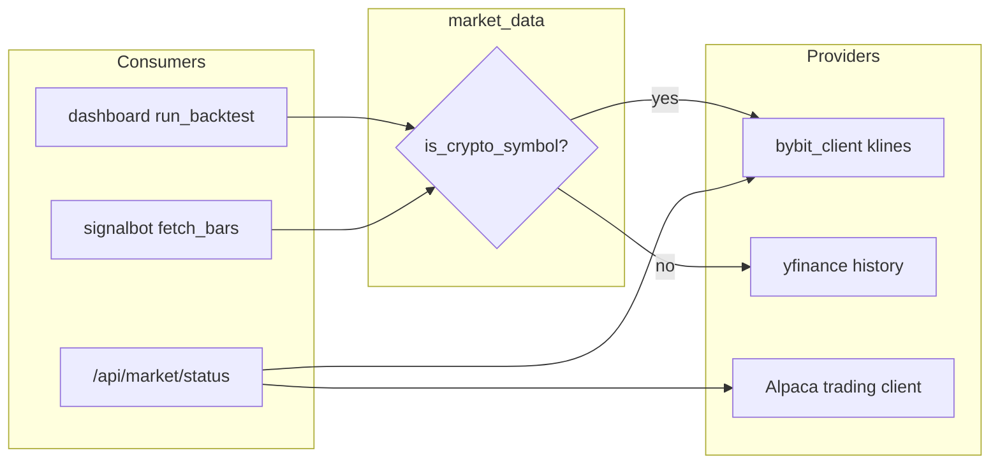

# Bybit crypto data + `-USD` routing

**Classification:** Architectural — new provider routing touches backtest API, signal bot, status API, and dashboard UI.

**Security:** You pasted live Bybit keys in chat. Rotate them in the Bybit console after implementation and keep them only in gitignored [`.env`](d:\Tp\tradebot\.env). Do not commit keys; add placeholder entries to a new [`.env.example`](d:\Tp\tradebot\.env.example) (README already references it but the file is missing).

## Convention (the “sign”)

| Symbol pattern | Provider | Notes |
|----------------|----------|--------|
| Ends with `-USD` (e.g. `BTC-USD`, `ETH-USD`) | **Bybit** spot klines | Map `BASE-USD` → Bybit `BASEUSDT` |
| Everything else (`SPY`, `AAPL`, …) | **yfinance** (unchanged) | Alpaca unchanged for paper live bot + `/api/live` |
| Bare `BTC` / `ETH` in watchlists | Still normalize to `BTC-USD` / `ETH-USD` in [`signals.py`](d:\Tp\tradebot\signals.py) → then Bybit |

Detection lives in one place, e.g. `is_crypto_symbol(sym) -> bool` on uppercased symbols: `sym.endswith("-USD")`.



## Backend modules (new)

1. **[`market_symbols.py`](d:\Tp\tradebot\market_symbols.py)** (small)
   - `is_crypto_symbol(symbol: str) -> bool`
   - `to_bybit_spot_symbol(symbol: str) -> str` — `BTC-USD` → `BTCUSDT`; validate base is alphanumeric

2. **[`bybit_client.py`](d:\Tp\tradebot\bybit_client.py)**
   - Base URL: `https://api.bybit.com` (config constant; optional `BYBIT_TESTNET` later if you want)
   - **Public** [`GET /v5/market/kline`](https://bybit-exchange.github.io/docs/v5/market/kline): `category=spot`, `interval` mapped from app timeframes (`1m`→`1`, `5m`→`5`, …, `1d`→`D`, `1w`→`W`)
   - Return a pandas DataFrame with columns `Open`, `High`, `Low`, `Close`, `Volume` and a **timezone-naive** datetime index (UTC→strip or convert consistently with existing yfinance frames)
   - **Pagination:** Bybit returns up to 1000 bars per call; loop with `end`/`start` ms until the requested window is covered (backtests with long daily history)
   - **Retries:** mirror [`fetch_history`](d:\Tp\tradebot\dashboard.py) (3 attempts, short sleep)
   - **Status helper:** `bybit_health()` — server time or trivial kline for `BTCUSDT`; `keys_configured` from `BYBIT_API_KEY` + `BYBIT_SECRET_KEY` (no need to sign for public klines; optional signed ping only if you want “keys valid” — start with `keys_configured` + public reachability to avoid coupling status to trading permissions)

3. **[`market_data.py`](d:\Tp\tradebot\market_data.py)** — single entry point
   - `fetch_history(symbol, kwargs)` — same `kwargs` shape as today’s yfinance usage in [`run_backtest_from`](d:\Tp\tradebot\dashboard.py) (`start`/`end`/`interval`/`auto_adjust` ignored for Bybit where N/A)
   - `fetch_recent_bars(symbol, timeframe, period_hint)` — used by signal bot (translate current [`TF_PERIOD`](d:\Tp\tradebot\signalbot.py) into a start time or minimum bar count, then Bybit fetch + **drop in-progress bar** using the same logic as today)

## Wire existing call sites

| File | Change |
|------|--------|
| [`dashboard.py`](d:\Tp\tradebot\dashboard.py) | Replace inline `fetch_history` with `market_data.fetch_history`; add `GET /api/market/status` returning `{ alpaca: {...}, bybit: {...} }` |
| [`signalbot.py`](d:\Tp\tradebot\signalbot.py) | `fetch_bars` → `market_data.fetch_recent_bars` |
| [`backtest.py`](d:\Tp\tradebot\backtest.py) | Optional one-line switch to `market_data.fetch_history` so CLI matches Lab for `BTC-USD` |

**Alpaca status:** Reuse the same checks as [`live_snapshot()`](d:\Tp\tradebot\dashboard.py) (keys present → `get_clock()`), without duplicating the full SMA/position payload — extract a thin `alpaca_health()` next to `live_snapshot` or in a tiny `alpaca_client.py` if `dashboard.py` grows.

**Error messages:** Keep 404 semantics for empty frames; for crypto, mention Bybit spot pair (e.g. “no Bybit data for BTCUSDT”).

## Frontend

| File | Change |
|------|--------|
| [`web/src/lib/schemas.ts`](d:\Tp\tradebot\web\src\lib\schemas.ts) | `MarketStatus` zod schema (`alpaca` / `bybit`: `connected`, `keys_configured?`, `reason?`) |
| [`web/src/hooks/use-api.ts`](d:\Tp\tradebot\web\src\hooks/use-api.ts) | `useMarketStatus()` SWR on `/api/market/status` (30s refresh, same as signals) |
| [`web/src/components/ticker-tape.tsx`](d:\Tp\tradebot\web\src\components\ticker-tape.tsx) | Compact indicators: existing Alpaca/live pulse + **Bybit** dot/label (“crypto data”) using `market` hook; keep file under 300 lines |

No Lab form change required — users already type `BTC-USD`; optional hint in [`symbols-field.tsx`](d:\Tp\tradebot\web\src\components\signals\symbols-field.tsx) helper text: “`-USD` tickers use Bybit”.

## Tests

New [`tests/test_market_data.py`](d:\Tp\tradebot\tests\test_market_data.py):

- `is_crypto_symbol` / `to_bybit_spot_symbol` unit cases
- Router chooses Bybit vs yfinance (mock `bybit_client` + `yfinance` with `unittest.mock`)
- Optional: recorded JSON fixture for one kline response → normalized DataFrame columns

Existing [`tests/test_signals_config.py`](d:\Tp\tradebot\tests\test_signals_config.py) stays valid (aliases still produce `-USD`).

## Docs & env

- **[`HANDSOFF.md`](d:\Tp\tradebot\HANDSOFF.md):** §2 diagram note (Bybit for `-USD`), §3 env vars (`BYBIT_API_KEY`, `BYBIT_SECRET_KEY`), §7 new endpoint, §9 gotcha (Bybit spot = USDT quote, 24/7 crypto, pagination limits)
- **[`README.md`](d:\Tp\tradebot\README.md):** Bybit keys optional for crypto Lab/signals; routing rule
- **`.env.example`:** `ALPACA_*`, `BYBIT_*`, Telegram/Discord placeholders

## Verification (after implementation)

```powershell
pytest tests/test_market_data.py tests/test_signals_config.py
# API: backtest BTC-USD daily + 1h in Lab; signal watchlist with BTC-USD
curl http://127.0.0.1:8000/api/market/status
cd web; npm run lint
```

## Out of scope (unless you ask later)

- Bybit trading / wallet execution (data + status only)
- Alpaca historical bars for equities
- Replacing yfinance for non-`-USD` symbols
