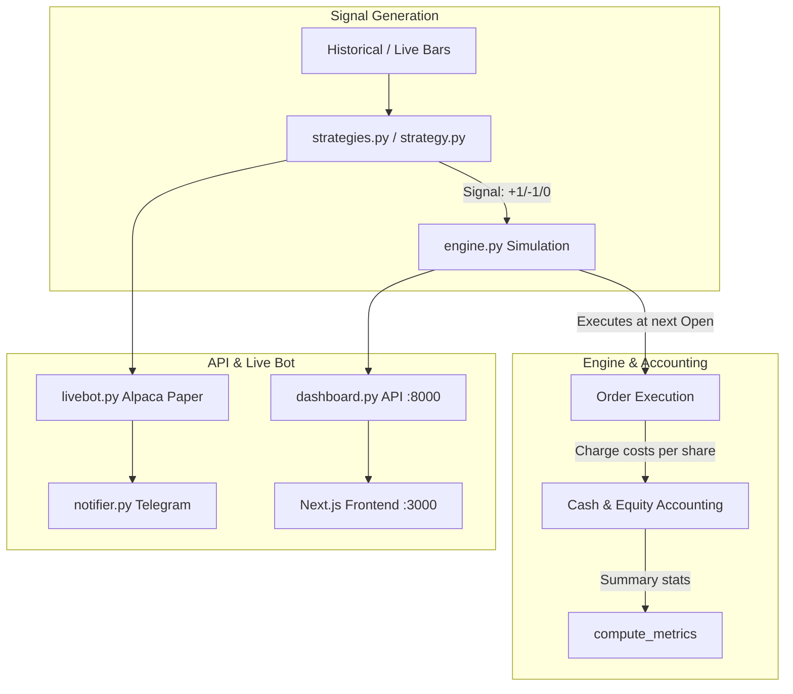

# TradeBot Comprehensive Review, Bug Fix & Test Plan

## 1. System Architecture & Bug Flow

---

## 2. Comprehensive Bug Review & Root Cause Analysis

### Critical Engine & Logic Bugs
1. **Quadratic Cost Inflation in `engine.py` (Critical)**
   - *Bug*: `cost = cost_per_share * qty` is already total dollar cost for `qty` shares. Code then calculates `(row["Open"] + cost) * qty` and `pnl = ... - 2 * cost * qty`. This multiplies costs by `qty` twice (i.e. `cost_per_share * qty^2`).
   - *Impact*: For 100 shares at $0.01/share, charges $200 instead of $2. For 1,000 shares, charges $20,000 instead of $20. Completely invalidates backtest P&L for `qty > 1`.
   - *Fix*: Normalize `cost_total = cost_per_share * abs(shares_traded)`. Subtract `cost_total` once on entry and once on exit.

2. **Short-Exit vs Long-Entry Collision when `allow_short=False` in `strategies.py` (Critical)**
   - *Bug*: In `vwap_reversion`, `opening_range_breakout`, and `rsi_mean_reversion`, strategies track internal state (`state = -1` for short) and emit `+1` to exit/cover. When `allow_short=False`, the engine ignores `-1` (stays `shares = 0`), but when `+1` arrives, the engine enters a **long buy position** at the bottom of a breakdown.
   - *Fix*: Pass `allow_short` into strategy signal generators or prevent strategies from entering short state/emitting cover buy signals when shorts are disabled.

3. **Reversal Short Entries Dropped in `engine.py` for Event-Based Strategies**
   - *Bug*: In `sma_crossover`, when `allow_short=True` and position is long, a `-1` signal only triggers the `elif` branch (exiting long to flat). On next bar `order` is 0, so the engine never enters short.
   - *Fix*: Support position flipping when `allow_short=True` upon reversal signals.

4. **VWAP NaN Propagation across Session in `strategies.py`**
   - *Bug*: `tp = tp.replace(0, np.nan)` causes `tp.cumsum()` to permanently become `NaN` for all subsequent bars in the day if any zero-volume bar occurs.
   - *Fix*: Keep `tp = 0` and divide cumsums with `.replace(0, np.nan)` on the denominator only.

5. **Crash on Negative Equity in CAGR Calculation (`engine.py`)**
   - *Bug*: `(final_equity / capital) ** (1 / years) - 1` raises `ValueError` / complex numbers when `final_equity <= 0`.
   - *Fix*: Guard `cagr = None` or `-1.0` when `final_equity <= 0`.

### API & Live Bot Bugs
6. **Live Bot Crash on Restart with Open Position (`livebot.py`)**
   - *Bug*: `open_trade = {}` at startup. If restarted while long on Alpaca, a sell signal accesses `open_trade["entry_price"]` causing `KeyError`.
   - *Fix*: Synchronize `open_trade` with Alpaca open position `avg_entry_price` if position exists at startup.

7. **Immediate Fallback in `fill_price()` (`livebot.py`)**
   - *Bug*: `order.filled_avg_price` is checked immediately without small polling delay, almost always falling back to `last_close`.
   - *Fix*: Brief retry loop (up to 2-3s) for `filled_avg_price` before falling back.

8. **Missing Costs in `/api/stats` (`dashboard.py`)**
   - *Bug*: `load_backtest_trades()` drops `costs` column from `trades.csv`, resulting in `costs_total: 0.0` in `/api/stats`.
   - *Fix*: Include `costs`, `side`, and `exit_type` in `load_backtest_trades()`.

9. **Sorting NoneType Crash in `/api/trades` (`dashboard.py`)**
   - *Bug*: `trades.sort(key=lambda t: t["exit_date"], reverse=True)` fails when open trades have `None` exit date.
   - *Fix*: Safe sort key: `key=lambda t: t.get("exit_date") or ""`.

10. **Timezone Offset Discrepancy in `livebot.py` Bar Check**
    - *Bug*: Comparing `datetime.now(NY).date()` directly with UTC bar timestamps causes false bar drops in the evening.
    - *Fix*: Convert bar timestamps to NY timezone before date comparison.

---

## 3. Test Suite Plan (`pytest`)

Create `tests/` directory with automated verification:
- `tests/test_engine.py`:
  - Verify exact linear cost calculations on entry, exit, round trips.
  - Test short selling execution, margin requirements, and EOD flattening.
  - Test open trade tracking at end of data.
  - Test CAGR, drawdown, win-rate edge cases (negative equity, single-bar data).
- `tests/test_strategies.py`:
  - Test SMA crossover (event signals, NaN handling, no lookahead).
  - Test VWAP reversion with zero-volume bars (verify no NaN propagation).
  - Test ORB with `allow_short=False` (verify no rogue long entries on short covers).
  - Test RSI mean reversion signal thresholds and exit boundaries.
- `tests/test_dashboard_api.py`:
  - Test Flask client for `/api/strategies`, `/api/stats`, `/api/trades`, `/api/live`, `/api/backtest/run`.
  - Test parameter validation, 400 bad params, 404 bad tickers.
- `tests/test_notifier.py`:
  - Mock Telegram HTTP POST responses (success, rate limit, network failure, unconfigured).
- `tests/test_livebot_helpers.py`:
  - Test `fill_price` polling, open position sync, heartbeat throttling.

---

## 4. Best Practices Implementation

1. **Shared Alpaca Service (`alpaca_service.py`)**:
   - Centralize client initialization, paper key validation, and account/position retrieval for both `livebot.py` and `dashboard.py`.
2. **Unified Signal Protocol**:
   - Explicit signal actions (`1` = buy long, `-1` = exit long / short, `0` = hold) honoring `allow_short` parameter uniformly across all 4 strategies.
3. **Structured API Error Handling & Logging**:
   - Add rotating file handler logging to `dashboard.py` (mirrored from `livebot.py`).

---

## 5. Future Roadmap & Features (To be tracked in `HANDOFF.md` and `REVIEW_AND_TODO.md`)

1. **Multi-Factor Stock & Crypto Analysis API (`/api/stock-analysis`)**:
   - Integrate the 8-dimension stock analysis engine (Earnings surprise, Fundamentals, Analyst sentiment, Momentum, Market regime, News risk flags) and Crypto top-20 analysis into the web desk.
2. **Dynamic Risk & Position Sizing Engine**:
   - ATR-based volatility sizing, fixed-fractional risk allocation, maximum portfolio daily loss kill-switch.
3. **Multi-Ticker Live Portfolio Scanner**:
   - Scan watchlist of symbols simultaneously for strategy setups and alert via Telegram.
4. **Two-Way Telegram Interactive Bot**:
   - Command listener (`/status`, `/pnl`, `/pause`, `/resume`, `/backtest SPY`).
5. **Strategy Lab Export & Comparison**:
   - Side-by-side strategy comparison tool on frontend, CSV/JSON report export.